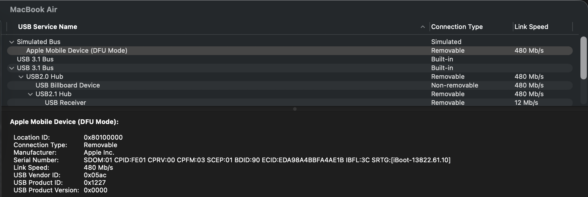
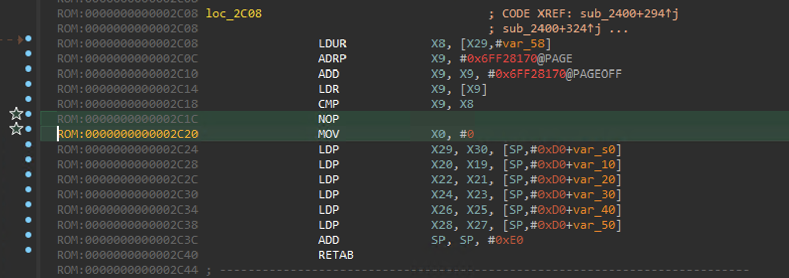
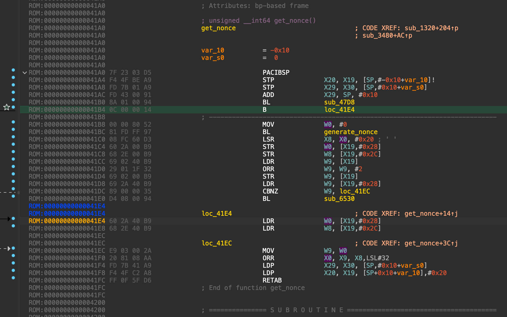
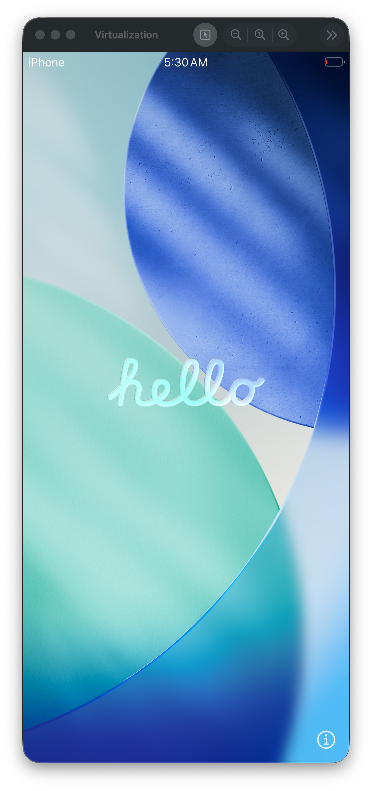
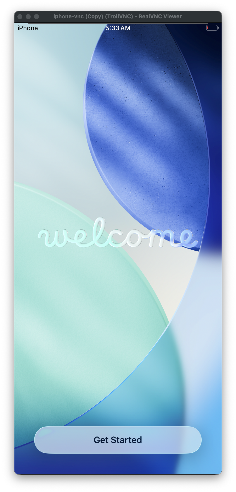
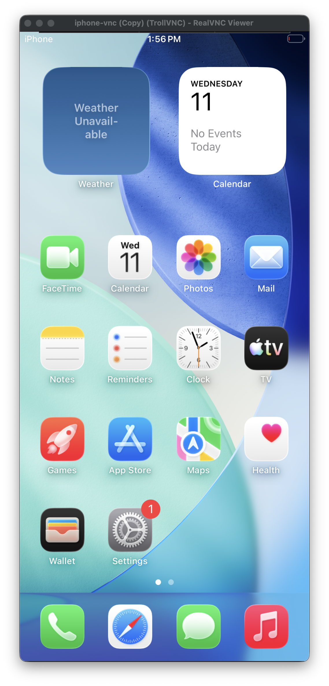
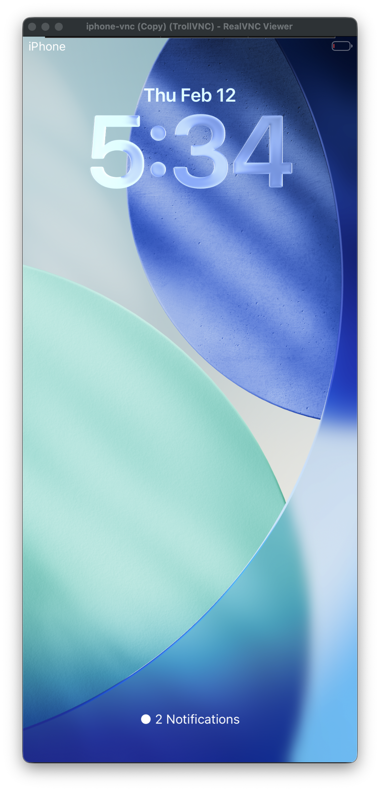
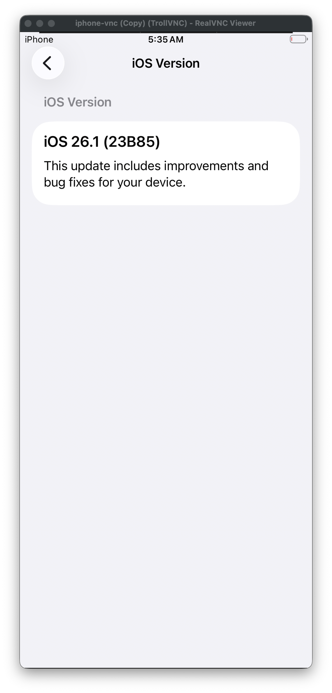

# super-tart-vphone GUIDE v2

# **Install Prerequisite before start.**

- [brew](https://brew.sh/)
- [pyimg4](https://pypi.org/project/pyimg4/)
- [idevicerestore](https://github.com/libimobiledevice/idevicerestore?tab=readme-ov-file#macos)
- [ipsw](https://github.com/blacktop/ipsw?tab=readme-ov-file#macos)
- other things (for compiling libirecovery)

```jsx
brew install pkg-config autoconf automake libtool
```

# Small tips?

CMD + H shortcuts will functions as home button on iPhone VM.

# 1. Prepare Host Environment

- Enter recovery mode

```bash
csrutil disable

nvram amfi_get_out_of_my_way=1

csrutil allow-reserach-guests enable
```

# 2. Create pcc-research vm

- Firmware will be downloaded from [**cloudOS 26.1 (23B85)**](https://appledb.dev/firmware/cloudOS/23B85.html)
- Wait until restoring progress done, VM will be eventually system off

```bash
cd /System/Library/SecurityResearch/usr/bin

./pccvre release download --release 35622

./pccvre instance create -N pcc-research -R 35622 --variant research
```

# 3. Setup initial super-tart vm

- Create VM using [JJTech0130’s super-tart](https://github.com/JJTech0130/super-tart)
- This will be required because super-tart-vphone couldn’t create new vm at this moment
- No matter what you choose any OS and any disk-size, **but please create vm with named “vphone”**

```bash
git clone --recursive https://github.com/JJTech0130/super-tart

cd super-tart

./scripts/run-signed.sh

./.build/debug/tart create vphone --disk-size 32 --from-ipsw /Volumes/sn850x/Firmwares/UniversalMac_12.0.1_21A559_Restore.ipsw
```

- Remove unnecessary files (except config.json)

```bash
rm ~/.tart/vms/vphone/AVPBooter.vmapple2.bin

rm ~/.tart/vms/vphone/disk.img

rm ~/.tart/vms/vphone/nvram.bin
```

- Copy files to vphone’s vm from pcc-research’s vm

```bash
cp ~/Library/Application\ Support/com.apple.security-research.vrevm/VM-Library/pcc-research.vm/config.plist ~/.tart/vms/vphone/config.plist

cp ~/Library/Application\ Support/com.apple.security-research.vrevm/VM-Library/pcc-research.vm/Disk.img ~/.tart/vms/vphone/disk.img

cp ~/Library/Application\ Support/com.apple.security-research.vrevm/VM-Library/pcc-research.vm/AuxiliaryStorage ~/.tart/vms/vphone/nvram.bin

cp ~/Library/Application\ Support/com.apple.security-research.vrevm/VM-Library/pcc-research.vm/SEPStorage ~/.tart/vms/vphone/SEPStorage
```

- Import AVPBooter.vresearch1.bin, AVPSEPBooter.vresearch1.bin to vphone’s vm

```bash
cp /System/Library/Frameworks/Virtualization.framework/Versions/A/Resources/AVPBooter.vresearch1.bin ~/.tart/vms/vphone/AVPBooter.vresearch1.bin

cp /System/Library/Frameworks/Virtualization.framework/Versions/A/Resources/AVPSEPBooter.vresearch1.bin ~/.tart/vms/vphone/AVPSEPBooter.vresearch1.bin
```

- Comile super-tart-vphone

```bash
git clone --recursive https://github.com/wh1te4ever/super-tart-vphone
cd super-tart-vphone

./scripts/run-signed.sh
```

- Rebuild irecovery; because vphone doesn’t support restore officially

```bash
git clone --recursive https://github.com/wh1te4ever/libirecovery

cd libirecovery

./autogen.sh

make -j8

sudo make install
```

- Let’s test if it’s working vm using [super-tart-vphone](https://github.com/wh1te4ever/super-tart-vphone)
- **No more needed to modify VZ.framework headers !!!**
- ~~At first, we need to modify VZ.framework headers because can’t use private API~~
- ~~Backup VZ.framework headers for future, and modify it~~
- For reference, My Xcode Version is 26.2
- … and finally build super-tart-vphone

```bash
# cp -rf /Applications/Xcode.app/Contents/Developer/Platforms/MacOSX.platform/Developer/SDKs/MacOSX.sdk/System/Library/Frameworks/Virtualization.framework/Versions/A/Headers /Applications/Xcode.app/Contents/Developer/Platforms/MacOSX.platform/Developer/SDKs/MacOSX.sdk/System/Library/Frameworks/Virtualization.framework/Versions/A/Headers.bak

git clone --recursive https://github.com/wh1te4ever/super-tart-vphone

cd super-tart-vphone

# cp -rf ./Virtualization_26.2_SDK/* /Applications/Xcode.app/Contents/Developer/Platforms/MacOSX.platform/Developer/SDKs/MacOSX.sdk/System/Library/Frameworks/Virtualization.framework/Versions/A/Headers/

# sudo chown -R 501:20 /Applications/Xcode.app/Contents/Developer/Platforms/MacOSX.platform/Developer/SDKs/MacOSX.sdk/System/Library/Frameworks/Virtualization.framework/Versions/A/Headers

./scripts/run-signed.sh

./.build/debug/tart run vphone --dfu
```

- If you found DFU device in System Information.app > Hardware > USB, then you are good to go!
    
    
    

# 4. Patch AVPBooter.vresearch1.bin

- Open ~/.tart/vms/vphone/AVPBooter.vresearch1.bin using IDA Pro
- Set process type as “ARM Little-endian” and disassemble as 64-bit code
- Text-search (slow!) with “0x4447”
- Patch epilogue to make always x0 returns 0
    
    
    
- Keep APNonce for future (this patch will not be needed, maybe)
NONC: 7c2db09d310ece0b36d50c86e4c3e6641684948cd6fc03262b0d0ed91a6cfbc3



# 5. Build custom firmware and restore

- At this moment, only supported iOS 26.1, so most things are hardcoded
- Grab custom firmware using python3 script

```bash
cd super-tart-vphone/CFW

python3 get_fw.py
```

- While super-tart stated in DFU mode, save shsh for future
- file format will be gzip compressed data, needed to be decompress
- Put “vphone.shsh” to supert-tart-vphone/CFW location

```bash
idevicerestore -e -y ./iPhone17,3_26.1_23B85_Restore -t

mv shsh/14445035891259750803-iPhone99,11-26.1.shsh shsh/14445035891259750803-iPhone99,11-26.1.shsh.gz

gunzip shsh/14445035891259750803-iPhone99,11-26.1.shsh.gz
```

- Run patch_fw.py

```bash
cd super-tart-vphone/CFW

python3 patch_fw.py
```

- Restore

```bash
idevicerestore -e -y ./iPhone17,3_26.1_23B85_Restore
```

- If restore done, you will get panic. Please rerun tart with DFU mode again.

```bash
./.build/debug/tart run vphone --dfu
```

# 6. Create/Run SSH Ramdisk

- Run get_rd.py and then run ./boot_rd.sh
- Get shell using ssh
- Please keep running iproxy to process step 7.

```bash
python3 get_rd.py

./boot_rd.sh

iproxy 2222 22 &
```

# 7. Boot fix

- Will break sealed rootfs

```bash
ssh root@127.0.0.1 -p2222
#pw: alpine

mount_apfs -o rw /dev/disk1s1 /mnt1

snaputil -l /mnt1
# (then will output will be printed with hash, result may be differ)
com.apple.os.update-8AAB8DBA5C8F1F756928411675F4A892087B04559CFB084B9E400E661ABAD119

snaputil -n <com.apple.os.update-hash> orig-fs /mnt1

umount /mnt1

exit
```

- Run fix_boot.py

```bash
python3 fix_boot.py
```

- shutdown

```bash
ssh root@127.0.0.1 -p2222

halt
```

# 8.  Test Booting

- Run and wait until setup screen showing

```bash
./.build/debug/tart run vphone --vnc-experimental
```



- Setup initial dropbear

```bash
# should command in same terminal session after run ./.build/debug/tart run vphone --vnc-experimental

export PATH='/usr/local/sbin:/usr/local/bin:/usr/sbin:/usr/bin:/sbin:/bin:/usr/bin/X11:/usr/games:/iosbinpack64/usr/local/sbin:/iosbinpack64/usr/local/bin:/iosbinpack64/usr/sbin:/iosbinpack64/usr/bin:/iosbinpack64/sbin:/iosbinpack64/bin'

/iosbinpack64/bin/mkdir -p /var/dropbear
/iosbinpack64/bin/cp /iosbinpack64/etc/profile /var/profile
/iosbinpack64/bin/cp /iosbinpack64/etc/motd /var/motd
```

- You can now get shell with ssh port 22222, and get control display with vnc port 5901 (using iproxy or device’s ip (device’s ip example: 192.168.64.XXX)
- All Default password is alpine









# 8. Jailbreak?

```bash
seo@seos-macbook super-tart-vphone % ./.build/debug/tart run vphone --dfu
```

```bash
seo@seos-macbook CFW % ./boot_rd.sh
```

```bash
iproxy 2222 22 &
```

```bash
python3 install_jb_procursus.py
```

```bash
ssh root@127.0.0.1 -p2222
halt
```

- Normal boot

```bash
seo@seos-macbook super-tart-vphone % ./.build/debug/tart run vphone --vnc-experimental
```

- Connect SSH and Install procursus bootstrap

```bash
ssh root@192.168.64.77 -p22222

iPhone:/private/preboot root# ls
331CCB798E0850B896DB053A3BB8CBD5E29DD5B31FF51828DB20F2860DCEA4CC2BF6186C4E45E6ADF0B43CCEBEBB0822

ln -sf /private/preboot/331CCB798E0850B896DB053A3BB8CBD5E29DD5B31FF51828DB20F2860DCEA4CC2BF6186C4E45E6ADF0B43CCEBEBB0822/jb-vphone/procursus /private/var/jb

mkdir -p /var/jb/var/mobile/Library/Preferences

chown -R 501:501 /var/jb/var/mobile/Library
chmod 0755 /var/jb/var/mobile/Library
chown -R 501:501 /var/jb/var/mobile/Library/Preferences
chmod 0755 /var/jb/var/mobile/Library/Preferences

/var/jb/prep_bootstrap.sh

#set password on phone/gui

export PATH='/sbin:/bin:/usr/sbin:/usr/bin:/var/jb/sbin:/var/jb/bin:/var/jb/usr/sbin:/var/jb/usr/bin'
export TERM='xterm-256color'

/var/jb/bin/touch /var/jb/.procursus_strapped
/var/jb/bin/chown 0:0 /var/jb/.procursus_strapped
/var/jb/usr/bin/chmod 0644 /var/jb/.procursus_strapped

/var/jb/bin/touch /var/jb/.installed_dopamine
/var/jb/bin/chown 0:0 /var/jb/.installed_dopamine
/var/jb/usr/bin/chmod 0644 /var/jb/.installed_dopamine

/var/jb/usr/bin/dpkg -i /private/preboot/331CCB798E0850B896DB053A3BB8CBD5E29DD5B31FF51828DB20F2860DCEA4CC2BF6186C4E45E6ADF0B43CCEBEBB0822/org.coolstar.sileo_2.5.1_iphoneos-arm64.deb

/var/jb/usr/bin/uicache -a

apt update
apt install libkrw0-tfp0
apt upgrade -y
```

- Run Sileo, Add Ellekit source and install Ellekit
- Repo: https://ellekit.space
- And then shutdown device
- Rerun as DFU mode

```bash
./.build/debug/tart run vphone --dfu
```

- Boot as ramdisk mode

```bash
seo@seos-macbook CFW % ./boot_rd.sh
```

- And finally, run

```bash
python3 install_jb_basebin.py
```

- Run VM

```bash
./.build/debug/tart run --vnc
```

# Appendix?

- Fix debugserver not working

```bash
ldid -e /usr/libexec/debugserver > /tmp/e.xml
iPhone:/var/jb/usr/lib/llvm-16/bin root# cd /var/jb/usr/lib/llvm-16
iPhone:/var/jb/usr/lib/llvm-16/bin root# ldid -S/tmp/e.xml -M ./debugserver
iPhone:/var/jb/usr/lib/llvm-16/bin root# ldid -e debugserver  
```

- Install FakeDeviceInfo tweak to make work as home bar like iPhone X model, enable Dynamic Island, and fake battery status on status bar